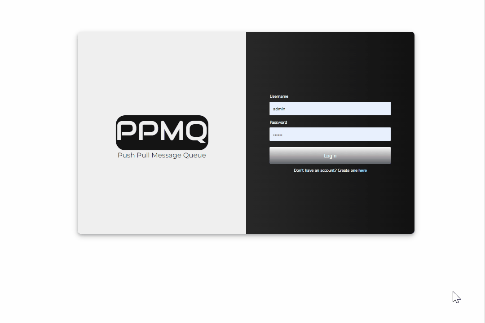

<p align="center">
 
</p>

[](https://www.npmjs.com/package/ppmq)

ppMQ 💬 is a lightweight **P**ush **P**ull **M**essage **Q**ueue built around websockets. In its current state, ppMQ is volatile and does not have any retention or redundency. Please take this into consideration and note that these will be improved upon in future releases. 

<p align="center">
 
</p>


 > __History__ 🏺: *Why websockets? well, I am glad you asked! The aim was to take advantage of my host server's free tier that only allowed WebSocket (others protocols were pay as you use). Rather than spending money to use their messaging queues, I built ppMQ to spend the money I saved on caffeine ☕*

## Ease of use
ppMQ is simple, after standing up your own ppMQ broker you can make use of the client side agent. 

- [Stand up your own ppMQ broker!](./doc/readme/ppmqBroker.md)
- [Use a client package that suites your language](./doc/readme/ppmqClient.mq)

There is only four methods you need in order to start pushing and pulling from your ppMQ broker!
These are:

### use
> Define your clients identity, the whereabouts of your broker, as well as the topics you wish to pull from.
```
ppMQ.use({
    'url': 'ws://localhost:1337',
    'auth': 'ffb6bdff-30fc-4249-b4ef-15413712427a',
    'topics': [
        'logback',
        'purchase',
        'customer.info',
        'store.address'
    ]
});
```

### connect
> After establishing your use for ppMQ we can then connect to the broker and begin using it!
```
ppMQ.connect();
```

### push
> Send a message to any topic, even if one does not exist, and those who are subscribed will receive it! 
```
ppMQ.push('baked-goods', 'Total items sold: 12');
```

### pull
> Pull down a message from any topic, including topics that you did not initially subscribed to, with ease! 
```
var message = ppMQ.pull('baked-goods');
if(message){
  // do something
}
```


That's all there is to it ☺️

## License

MIT

**Free Software, Hell Yeah!**
